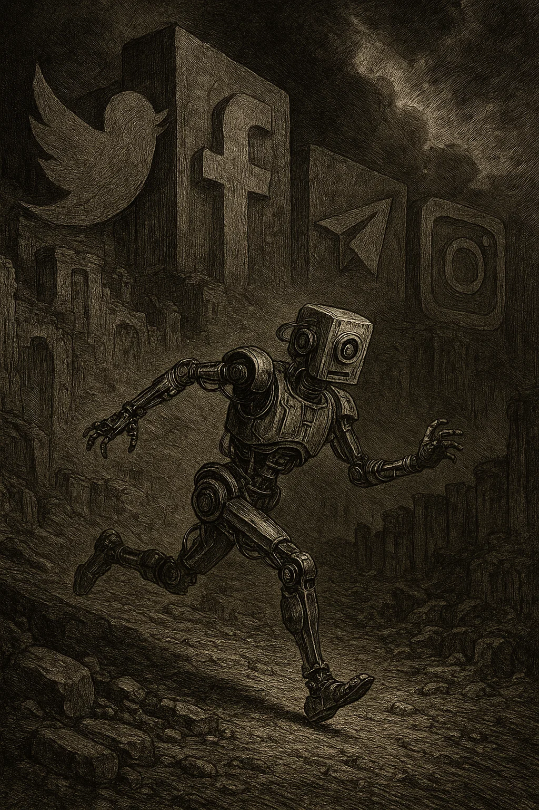

For a long time now my country has been in a state of dissaray. Spite, fear and hatred are the driving forces behind our society and our politics. 
Living amongst a people who literally cannot find a shred of common gorund between each other has been mentally exhausting and the constant exposure to the ill thought 
aggression has made me tired and sad. I'm leaving my social media accounts behind as I find myself more and more these daysd unfollowing, silencing, muting, and basically begging to not be bombarded with this vile shit stirring rhetoric every day. It often feels like there are forces out there determined to soil my mind and emotional well being by inflitrating my mind space with this vile hate filled spew. 

Please stop being dicks to one and other. 